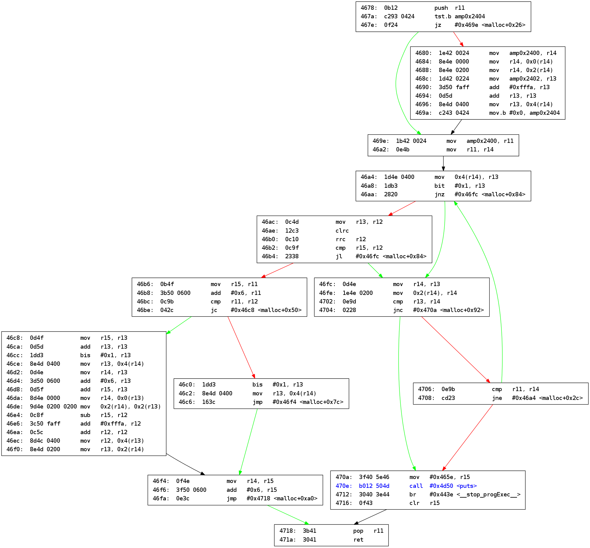

msp2dot
-------
A script to produce graphs from MSP430 assembly files using pydot. This script is intended for use in [microcorruption ctf](http://www.microcorruption.com), which is based on the MSP430.

Usage:
------
usage: msp2dot [-h] CODE SUBROUTINE

positional arguments:
  CODE        Path to assembly file.
  SUBROUTINE  Name of subroutine to graph. Graph is written to SUBROUTINE.png

Dependencies:
-------------
Besides Python 2.7 the only dependency is `pydot`, which can be installed using your package manager or pip:
`pip2 install pydot`

Example
-------
`msp2dot chernobyl.asm malloc`

Credit:
-------
This project is inspired by [Nelson Elhage's](https://github.com/nelhage) [reverse-android](https://github.com/nelhage/reverse-android). His formating of code labels is also employed here.
